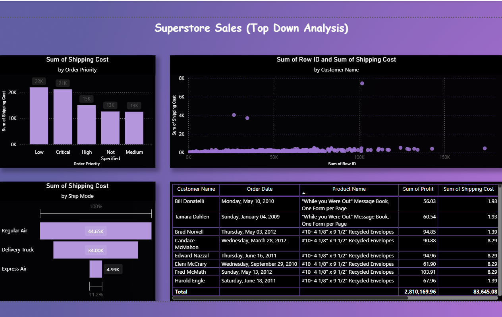
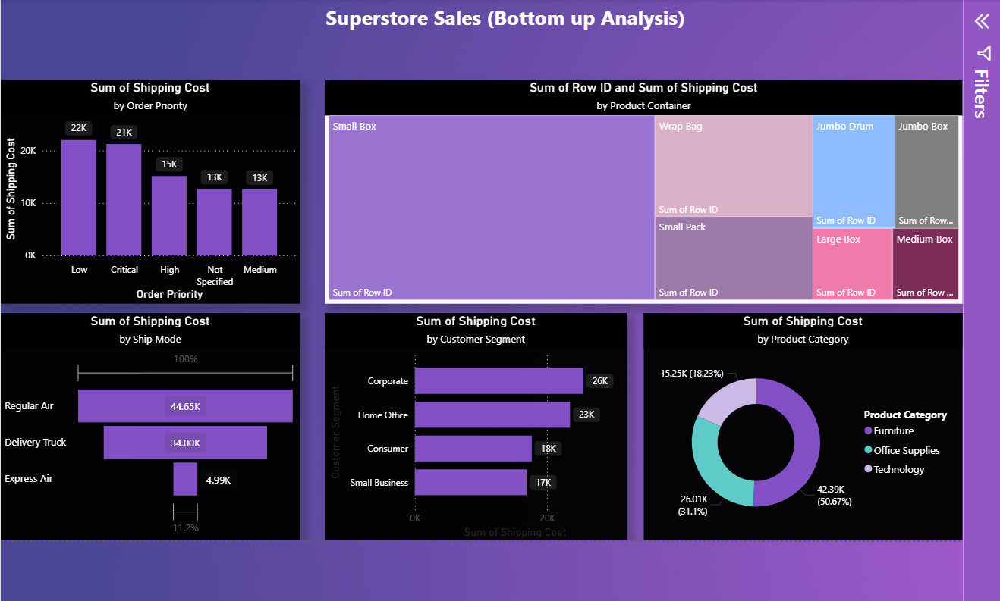

---
title:Superstore_Sale(top_down& bottom_up_Analysis)
---

# 📊 Superstore_Sale(top_down& bottom_up_Analysis)

## 📌 Project Overview
This project analyzes sales data to track performance, identify trends, and provide actionable insights.

---

## 🎯 Objectives
- Analyze revenue trends over time
- Identify top-performing products
- Understand regional performance

---

## 🛠 Tools Used
- Power BI
- DAX
- Power Query

---

## 📂 Dataset
- Source: Sample sales dataset
- Contains: Orders, customers, revenue, regions

---

## 📸 Dashboard Preview

### Overview
images/dashboard.png

### Revenue Trends

---

## 🔍 Key Insights
- Sales increased by 25% in Q4
- Region X is the highest contributor
- Product A generates most revenue

---

## 📁 Files Included
- `.pbix` file
- Dataset
- Images

---

## 🚀 How to Use
Download the `.pbix` file and open it in Power BI Desktop.

---

## 👤 Author
**Nancy Sahu**
